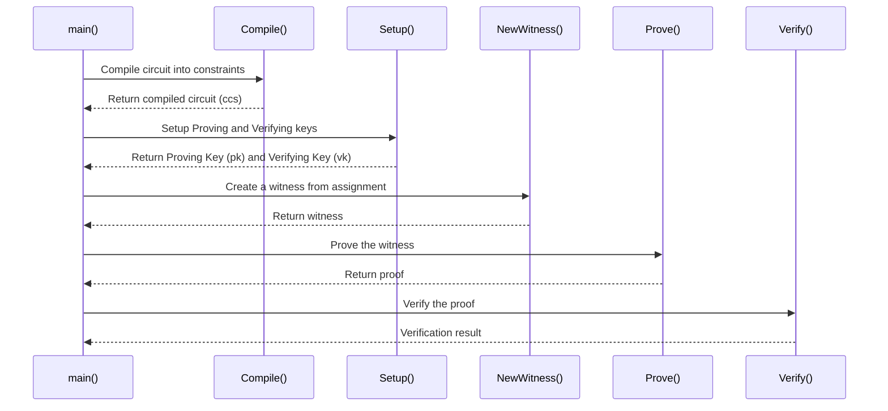

# Simle Gnark Implementation
## Installation
Fallow https://go.dev/doc/install for installation golang.

## Installing dependencies
```bash
go mod tidy  
```

## Run Code
```bash
go run main.go 
```



